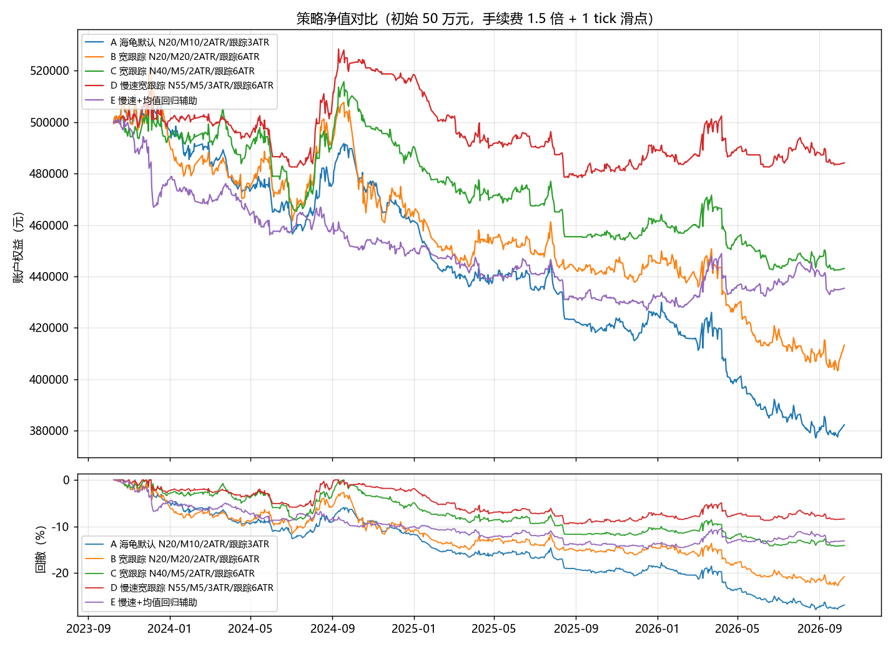

# 回测报告：郑商所 8 品种日线趋势策略

生成时间：2026-10-09 15:08。所有数字来自本仓库脚本的真实运行，命令见文末。

## 1. 口径与成本假设

- 初始权益 50 万元（赛制虚拟保证金规模）。
- **手续费按交易所标准 1.5 倍收取**；当日开当日平按「平今仓」费率结算。
- 每次成交再计 1 个最小变动价位的滑点。
- 保证金按交易所标准 × 1.3 安全垫占用，上限为权益的 60%。
- 信号在收盘产生、次日开盘成交；止损是盘中挂单，跳空穿越时按更差的开盘价成交。

## 2. 数据质量

| 品种 | 名称 | 行数 | 起始 | 结束 | 剔除脏bar | 单日涨跌超4%天数 | 结论 |
|---|---|---|---|---|---|---|---|
| CF0 | 一号棉花 | 5,243 | 2005-01-04 | 2026-10-08 | 58 | 81 | 通过 |
| SR0 | 白砂糖 | 5,016 | 2006-01-12 | 2026-10-08 | 19 | 38 | 通过 |
| TA0 | 精对苯二甲酸 | 4,794 | 2006-12-19 | 2026-10-08 | 15 | 121 | 通过 |
| OI0 | 菜籽油 | 4,682 | 2007-06-08 | 2026-10-08 | 13 | 80 | 通过 |
| RM0 | 菜籽粕 | 3,337 | 2012-12-28 | 2026-10-08 | 0 | 89 | 通过 |
| FG0 | 玻璃 | 3,351 | 2012-12-03 | 2026-10-08 | 0 | 133 | 通过 |
| MA0 | 甲醇N | 2,855 | 2014-12-24 | 2026-10-08 | 0 | 119 | 通过 |
| SA0 | 纯碱 | 1,655 | 2019-12-06 | 2026-10-08 | 0 | 121 | 通过 |

> **换月跳空是已知偏差**：新浪连续合约在主力换月处存在价格跳空，会让突破信号产生假触发。真实交易需按主力合约代码下单，并按 `python scripts/contracts.py` 输出的换月提醒提前移仓。

## 3. 候选策略分段表现

参数含义：`N`=入场通道天数，`M`=离场通道天数，止损与跟踪止损都按 ATR 倍数表示。

| 候选策略 | 区间 | 总收益率 | 年化收益率 | 最大回撤 | 夏普比率 | 交易笔数 | 胜率 | 活跃交易日占比 | 手续费合计 | 因风控放弃的开仓次数 |
|---|---|---|---|---|---|---|---|---|---|---|
| A 海龟默认 N20/M10/2ATR/跟踪3ATR | 全历史 | 52.47% | 1.97% | 31.08% | 0.3137 | 1,023 | 31.28% | 30.07% | 13,704 元 | 2 |
| A 海龟默认 N20/M10/2ATR/跟踪3ATR | 2016 年至今 | -31.34% | -3.45% | 34.63% | -0.3696 | 677 | 29.69% | 38.93% | 5,728 元 | 0 |
| A 海龟默认 N20/M10/2ATR/跟踪3ATR | 近 3 年 | -23.53% | -8.61% | 27.82% | -1.1363 | 208 | 26.44% | 42.92% | 2,003 元 | 0 |
| A 海龟默认 N20/M10/2ATR/跟踪3ATR | 近 1 年 | -4.51% | -4.54% | 17.03% | -0.4415 | 70 | 28.57% | 43.39% | 1,053 元 | 0 |
| B 宽跟踪 N20/M20/2ATR/跟踪6ATR | 全历史 | 80.76% | 2.78% | 23.76% | 0.3972 | 820 | 29.63% | 21.49% | 11,506 元 | 2 |
| B 宽跟踪 N20/M20/2ATR/跟踪6ATR | 2016 年至今 | 2.24% | 0.21% | 22.21% | 0.0717 | 536 | 29.10% | 27.55% | 5,200 元 | 0 |
| B 宽跟踪 N20/M20/2ATR/跟踪6ATR | 近 3 年 | -17.34% | -6.19% | 22.70% | -0.6919 | 158 | 24.68% | 30.54% | 1,726 元 | 0 |
| B 宽跟踪 N20/M20/2ATR/跟踪6ATR | 近 1 年 | 2.24% | 2.26% | 15.07% | 0.2133 | 55 | 20.00% | 32.64% | 1,036 元 | 0 |
| C 宽跟踪 N40/M5/2ATR/跟踪6ATR | 全历史 | 51.31% | 1.94% | 18.43% | 0.3464 | 802 | 35.91% | 25.04% | 11,214 元 | 1 |
| C 宽跟踪 N40/M5/2ATR/跟踪6ATR | 2016 年至今 | -7.84% | -0.76% | 15.85% | -0.0802 | 517 | 35.01% | 31.57% | 5,393 元 | 0 |
| C 宽跟踪 N40/M5/2ATR/跟踪6ATR | 近 3 年 | -11.38% | -3.97% | 14.24% | -0.6309 | 147 | 36.73% | 31.50% | 1,882 元 | 0 |
| C 宽跟踪 N40/M5/2ATR/跟踪6ATR | 近 1 年 | 1.83% | 1.84% | 9.83% | 0.2250 | 48 | 37.50% | 30.58% | 1,101 元 | 0 |
| D 慢速宽跟踪 N55/M5/3ATR/跟踪6ATR | 全历史 | 33.54% | 1.35% | 13.49% | 0.2995 | 648 | 37.19% | 21.07% | 8,124 元 | 3 |
| D 慢速宽跟踪 N55/M5/3ATR/跟踪6ATR | 2016 年至今 | -4.49% | -0.43% | 14.31% | -0.0527 | 418 | 36.36% | 26.74% | 4,044 元 | 1 |
| D 慢速宽跟踪 N55/M5/3ATR/跟踪6ATR | 近 3 年 | -3.17% | -1.08% | 9.45% | -0.1792 | 119 | 36.13% | 26.82% | 1,324 元 | 0 |
| D 慢速宽跟踪 N55/M5/3ATR/跟踪6ATR | 近 1 年 | 3.34% | 3.37% | 5.62% | 0.4425 | 40 | 37.50% | 27.69% | 682 元 | 0 |
| E 慢速+均值回归辅助 | 全历史 | -34.80% | -1.96% | 39.67% | -0.3458 | 1,050 | 42.95% | 31.31% | 8,449 元 | 15 |
| E 慢速+均值回归辅助 | 2016 年至今 | -23.88% | -2.52% | 28.62% | -0.4661 | 667 | 44.08% | 38.77% | 6,156 元 | 3 |
| E 慢速+均值回归辅助 | 近 3 年 | -12.92% | -4.54% | 14.78% | -0.9647 | 194 | 45.88% | 39.20% | 1,832 元 | 0 |
| E 慢速+均值回归辅助 | 近 1 年 | 6.13% | 6.18% | 5.35% | 0.7659 | 65 | 50.77% | 40.08% | 1,282 元 | 0 |

## 4. 结论

1. **稳健性优先**：在全部 5 个候选里，「D 慢速宽跟踪 N55/M5/3ATR/跟踪6ATR」是四个考察区间的**最差区间收益最高者**。评价趋势策略一定要看多个区间：只看全历史会被 2008-2015 年的大趋势误导。
2. **近 3 年表现**：总收益 -3.17%，最大回撤 9.45%，共 119 笔，活跃交易日占比 26.82%，手续费合计 1,324 元。
3. **胜率低是正常的**：全历史胜率只有 37.2%，靠少数几笔大趋势赚钱，必须能忍住连续 5-8 笔小亏。这正是必须用固定比例风险、而不是凭感觉加仓的原因。
4. **手续费不是主要成本**：全历史手续费合计 8,124 元，只占初始权益的 1.62%。真正吃掉收益的是被反复止损打掉的尝试（胜率不足四成）—— 也就是说，「少交易省手续费」并不是提高收益的关键，「提高信号质量」才是。
5. **edge 在衰减**：把「D 慢速宽跟踪 N55/M5/3ATR/跟踪6ATR」的全历史数字和近 3 年数字并排看，近十年的趋势性明显弱于 2005-2015 年。**不要把这个策略当成赚钱机器**，它的作用是给交易提供一个有正偏度、可复盘的框架。

## 5. 净值曲线



## 6. 复现命令

```powershell
python scripts/contracts.py
python scripts/optimize.py --refresh
```

## 7. 这个回测**不能**说明什么

- 不能说明未来 40 个交易日会重复历史收益。比赛的窗口太短，单次结果主要由运气决定，而不是由期望值决定。
- 不能说明策略可以自动下单：本项目**不下单、不接交易接口**，只输出人工执行的操作清单。
- 不能替代对赛制规则的核验：收益率/回撤/活跃度的具体计算公式尚未从官方文件确认。
